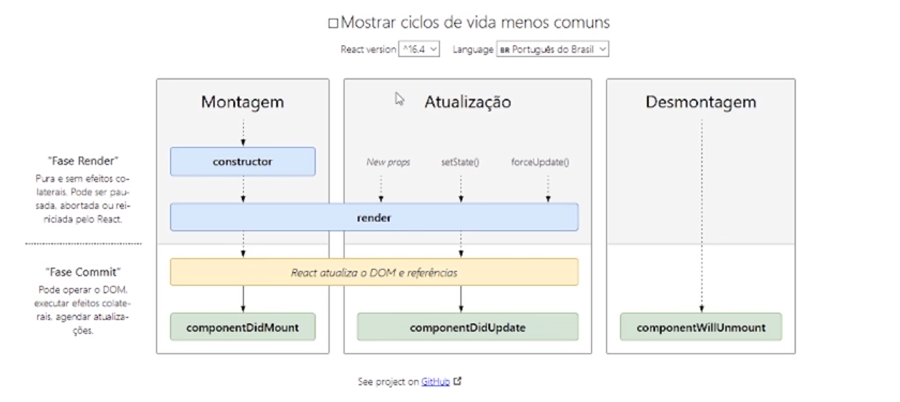

# React

JSX

react -> lib
React -> ecossistema

Adjacent JSX elements must be wrapped in an enclosing tag

- a function App() deve retornar um único elemento pai

## Chaves

- Tudo o que tiver entre chaves é compilado como código javascript

## Lista

- Cada elemento de uma lista deve ter uma key única

## Componentes

# CSS

## ClassName

## Reset CSS

## Conflito

Para evitar conflito de nomes, utilizar nome de classes usando o nome do componente como prefixo, por exemplo.

lista-de-notas
lista-de-notas_header

## Processamento de eventos

- OnChange
- Bind

## Props e state

## Ciclo de Vida de um Component React

## SVG

https://fonts.google.com/icons

## Fragment

- usar uma tag vazia que não cria um elemento pai <></>

## Stateful Component

## Stateless Component

# Stop Propagation

# PreventDefault

---

# Ciclo de Vida de um Componente React

https://pt-br.reactjs.org/docs/state-and-lifecycle.html

https://pt-br.reactjs.org/docs/react-component.html#shouldcomponentupdate

- ComponentDidMount
- ComponentWillUnMount
- componentDidUpdate()

1- Não modifique o state corretamente
2- Não use setState no construtor, use no componentDidMount

3- Atualizações de State Podem Ser Assíncronas
4- Atualizações de State São Mescladas
5- Os Dados Fluem para Baixo (um componente pode passar suas props para outro componente filho)

## Conteúdos

### Styled componente

### Context e redux

### Next

### Material Ui

- https://mui.com/pt/

### Skeleton

### effects

### docusaurus
